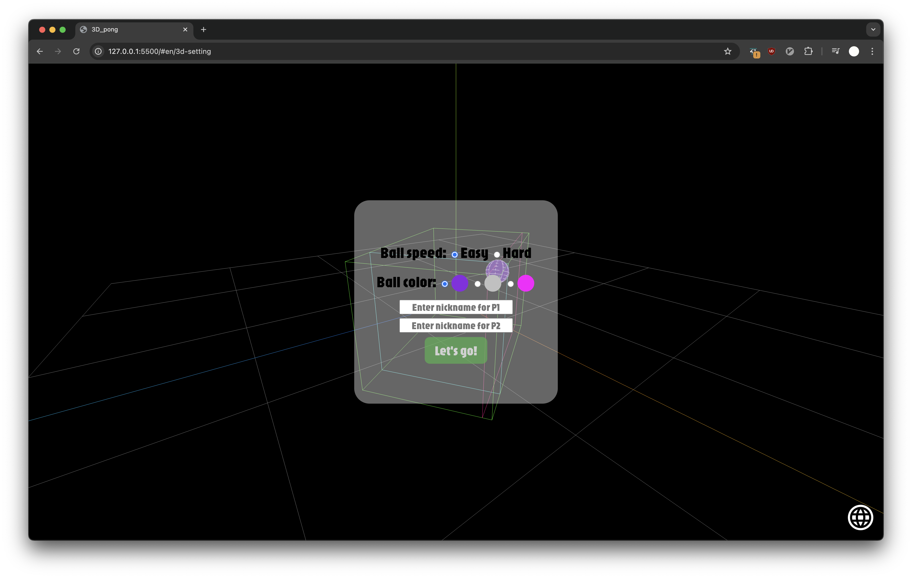
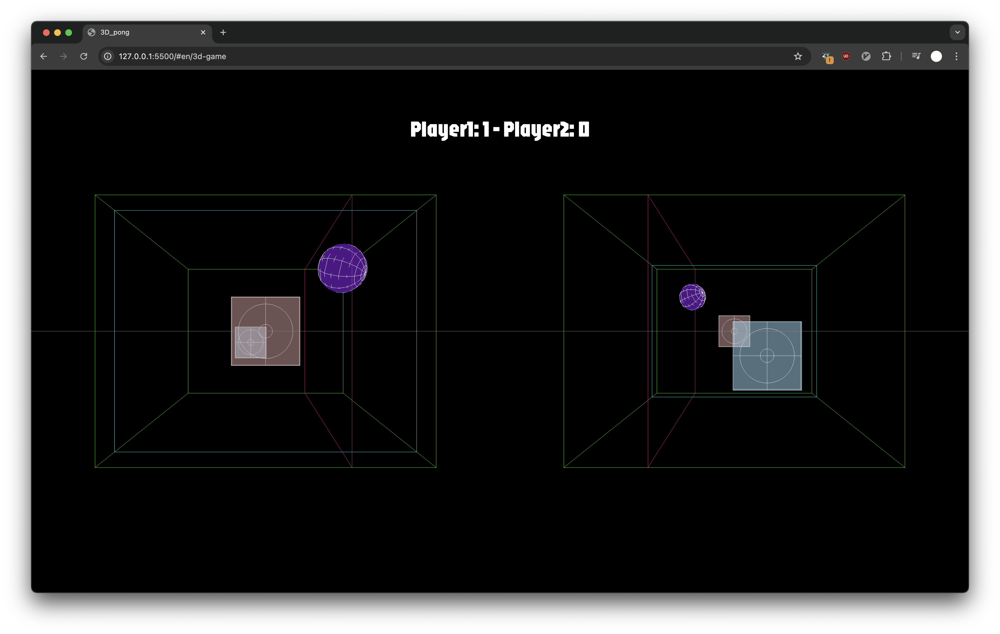
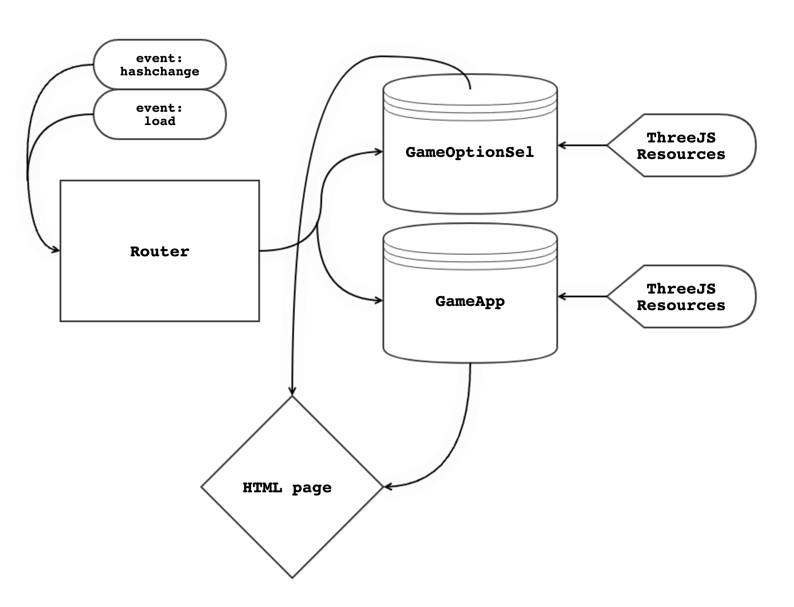

# 3D Pong in Vanilla JS with a simple SPA




## SPA structure


## How to play
**Play through the website**
1. Follow the link: [[3D_Pong](https://yusekim.github.io/3D_Pong_in_JS/)]
2. Set the ball speed, color and nickname for players
3. Player1 uses `WASD` keys, Player2 uses `←↑↓→`


**Download and play(optional)**
1. clone this git repository
```bash
   git clone https://github.com/username/3D_Pong_in_JS.git
```
2. Use simple server(such as VSC live-server extension) to run

---
## 개요
3D Pong은 Vanilla JS를 사용하여 제작한 3D 게임입니다. SPA(단일 페이지 애플리케이션) 구조로 구현되어 있으며, 간단한 게임 설정도 포함되어 있습니다.

게임 플레이 링크: [3D Pong](https://yusekim.github.io/3D_Pong_in_JS/)

## 스크린샷


## SPA 구조


## 게임 방법
1. 위 링크를 따라 접속합니다. [3D Pong](https://yusekim.github.io/3D_Pong_in_JS/)
2. 설정 화면에서 볼 속도, 색상, 플레이어 닉네임을 지정합니다.
3. 플레이어 컨트롤:
   - Player1: `WASD`
   - Player2: `←↑↓→`


**설치 및 실행 (옵션)**
로컬에서 실행하려면:
1. 레포지토리를 클론합니다.
```bash
git clone https://github.com/username/3D_Pong_in_JS.git
```
2. 간단한 서버 구동(예: VSC의 live-server extension)을 활용하여 실행
